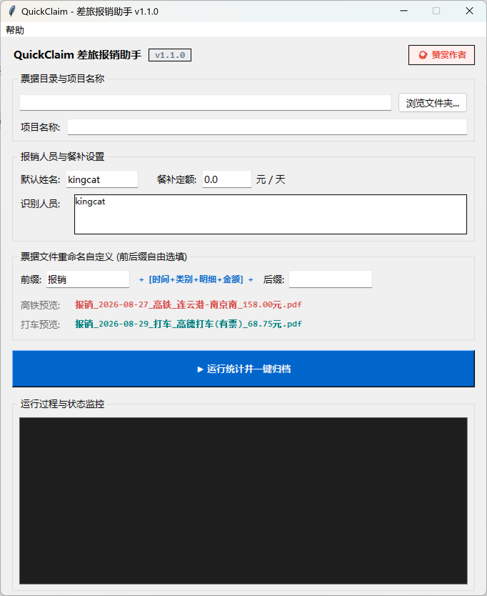

<div align="center">

  # QuickClaim - 差旅报销助手

  <p align="center">
    <a href="README.md">English</a> | <b>简体中文</b>
  </p>

  <br>

  <p align="center">
    🚄🧾 告别繁琐的手工对账与制表，一键穿透解析电子发票、智能归档，秒级导出标准审批单。
  </p>

  <!-- 状态与技术栈徽章 -->
  <p align="center">
    <a href="https://github.com/xuelefei4-blip/QuickClaim/actions"></a>
    
    
    
    
    
  </p>

  <p align="center">
    <a href="https://github.com/xuelefei4-blip/QuickClaim/issues"></a>
    <a href="https://github.com/xuelefei4-blip/QuickClaim/discussions"></a>
  </p>

</div>

---

## 📸 运行预览

<p align="center">
  
</p>

---

## ✨ 核心特性

* 🤖 **智能单人/多人模式自适应**：自动侦测文件夹结构，检测到人员子目录即切入多人合并处理，平铺票据则自动归集至单人，全程零手动切换。
* 🚄 **12306 铁路数电票解析**：深度适配国铁最新版电子客票，精准捕获乘车日期、始发/到达站、车次代号及票面金额[cite: 13]。
* 🚖 **行程单明细拆解与双向核验**：全面支持高德、滴滴、T3 出行等行程单，优先按单笔真实行程展开落账，并与发票总额交叉校验，自动追加 `(有票)` 合规标识[cite: 6, 12]。
* 📊 **财务级标准 Excel 报销单**：
  * **左侧人员合并**：姓名跨行大单元格垂直居中合并[cite: 7]。
  * **全局连续编号**：流水序号自上而下全局顺延（1, 2, 3...）[cite: 7]。
  * **独立与全局求和**：每位人员附带独立【合计】小计行，底部自动生成全局【汇总】公式[cite: 7]。
  * **冻结首发表头**：大批量凭证滚动浏览时表头悬浮固定[cite: 7]。
* 📁 **规范化物理归档**：在工作区内按 `[人员]/[票据类型]/` 自动收拢并重命名凭证，内建同名防覆盖机制。
* 🪟 **单文件绿色版免安装**：基于 PyInstaller 完整封包，无需安装 Python 环境或依赖库，解压即用[cite: 6]。

---

## 📦 项目结构

```text
QuickClaim/
├── parsers/                   # 专职票据解析引擎
│   ├── __init__.py            # 解析器统一调度导出
│   ├── taxi_parser.py         # 网约车行程单（逐单拆解）与数电发票解析器
│   └── train_parser.py        # 12306 铁路数电票解析器
├── app.py                     # 桌面 GUI 交互与归档调度主程序
├── excel_builder.py           # 矩阵式差旅报销审批单 Excel 绘制引擎
├── extractor.py               # PDF 原生文本层穿透提取与特征路由分发
└── README.md
```

## 🚀 快速开始
方式一：绿色免安装版（推荐）
直接从 Releases 页面下载最新的 QuickClaim_差旅报销助手.exe，双击即可直接运行[cite: 6]。

方式二：本地源码运行
克隆代码仓库：
git clone [https://github.com/xuelefei4-blip/QuickClaim.git](https://github.com/xuelefei4-blip/QuickClaim.git)
cd QuickClaim

配置 Python 环境并安装依赖：

Bash
python -m venv .venv
.venv\Scripts\activate
pip install pypdf openpyxl
启动程序：

Bash
python app.py

方式三：打包独立可执行文件 (.exe)Bashpip install pyinstaller
pyinstaller --clean --noconsole --onefile --name "QuickClaim_差旅报销助手" --collect-all openpyxl --collect-all pypdf app.py
📄 开源协议本项目基于 MIT License 开源协议。   